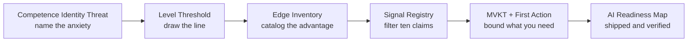

# LENS AI Readiness Map

> A five-stage personal audit that turns AI anxiety into a bounded, actionable plan — with your name on it.

  

## Build this yourself

Everything below is re-parameterized for your context. Paste the block into your chosen workspace and replace the bracketed tokens.

```text
# LENS AI Readiness Map
Name: [YOUR NAME]  (example: Marcus Osei)
Role: [YOUR ROLE AND DOMAIN]  (example: public-sector procurement lead)

## Level Threshold
Above: [YOUR ABOVE-THRESHOLD LAYERS]  (example: Workflow Evaluation, Strategic Oversight, Output Evaluation)
Below: [YOUR BELOW-THRESHOLD LAYERS]  (example: Model Architecture, Infrastructure, Fine-tuning)

## Edge Statement
[YOUR EDGE STATEMENT]  (example: Twelve years of public-sector procurement law combined with the ability to use AI to draft and compare contract clauses at scale — while keeping the regulatory judgment no model can replicate.)

## First Action (next 7 days)
[YOUR FIRST ACTION]  (example: Spend 45 minutes using a general-purpose AI tool to draft the scope section of the next RFP. Done when I have a draft I can redline. Builds: prompt-to-document fluency.)

## MVKT — releasing
[YOUR RELEASING LIST]  (example: transformer architecture internals, fine-tuning pipelines, embedding distance math)
```

## How it was built

Randeep Bhatia ran a full LENS audit — five stages, no shortcuts.



## The story

Randeep Bhatia completed this audit as part of Chapter 1 of the course. The map, brief, and chat context in this repo are the direct outputs of that work — not a template, not a summary, but the actual audit.

## Proof

- Full map: [lens-readiness-map.md](./lens-readiness-map.md)
- Manager brief: [readiness-brief.md](./readiness-brief.md)
- Reusable chat context: [blueprints/chat.md](./blueprints/chat.md)
- Blank worksheet: [blueprints/worksheet.md](./blueprints/worksheet.md)

## my-build/

Put screenshots, notes, and follow-up actions here.

---

Model-assisted draft — review before sharing.
