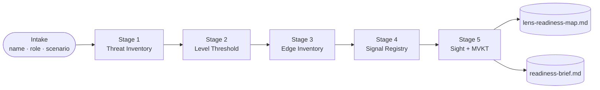

# LENS AI Readiness Map

> A five-stage self-audit that turns professional AI anxiety into a bounded, actionable plan — built by Test User for the role of Product Manager in SaaS.

  

## Build this yourself

Everything below is a reusable blueprint. Swap the bracketed tokens for your own context and paste the block into your chosen workspace to start your own LENS audit.

```text
# LENS Audit — quick-start

Auditor: [YOUR NAME]          # e.g. Jordan Reyes
Role:    [YOUR ROLE]          # e.g. Senior Operations Manager, logistics sector

Stage 1 — Threat Inventory
  Log three AI-anxiety incidents. For each: trigger phrase, internal response,
  manufactured-or-real verdict with one sentence of reasoning.
  Pattern Summary: name the mechanism (Adoption Mirage / Competence Identity
  Threat / Jargon Tollbooth) driving most of your incidents.

Stage 2 — Level Threshold
  Mark each AI stack layer Relevant / Not Relevant with a job-specific reason.
  Draw your threshold. Name the Load-Bearing Myth it contradicts.

Stage 3 — Edge Inventory
  List 5-7 domain-specific Knowledge Assets.
  Map at least 4 to amplifier effects (speed / scale / precision).
  Write a 3-5 sentence Edge Statement concrete enough to say in a meeting.

Stage 4 — Signal Registry
  Evaluate 10 AI claims: High / Low / Deferred Signal with 2-3 sentences each.
  Map 2 domain-specific failure mode scenarios.
  Name at least one Jargon Tollbooth term and place it below your threshold.

Stage 5 — Sight (MVKT + First Action)
  MVKT: ≥3 items to learn, ≥2 to question, ≥3 to release.
  First Action: specific observable behavior, completion criterion, named skill.
  Executive Summary: 150-200 words, plain language, no unexplained jargon.
```

## How this audit flows



Each stage feeds the next: the Threat Inventory calibrates the Level Threshold, the threshold scopes the Edge Inventory, the Edge frames the Signal Registry, and the Registry informs the MVKT. Nothing is busywork.

## The story behind this build

Test User completed this audit as a Product Manager in SaaS professional navigating the gap between AI hype and what the role actually requires. The five stages took roughly 100 minutes across one focused session. The finished map is a referenceable document — not a one-time exercise — designed to be revisited at 30-day intervals as the professional landscape shifts.

## Proof artifacts

- **Readiness map:** [lens-readiness-map.md](./lens-readiness-map.md) — the full five-stage LENS audit
- **Executive brief:** [readiness-brief.md](./readiness-brief.md) — 150-200 word manager-ready summary
- **Blank worksheet:** [blueprints/worksheet.md](./blueprints/worksheet.md) — reuse this template for your next 30-day review
- **Chat blueprint:** [blueprints/chat.md](./blueprints/chat.md) — continue the audit in any chat workspace

## my-build/

Put screenshots, session notes, and 30-day review snapshots here.

---

Model-assisted draft — review before sharing.
